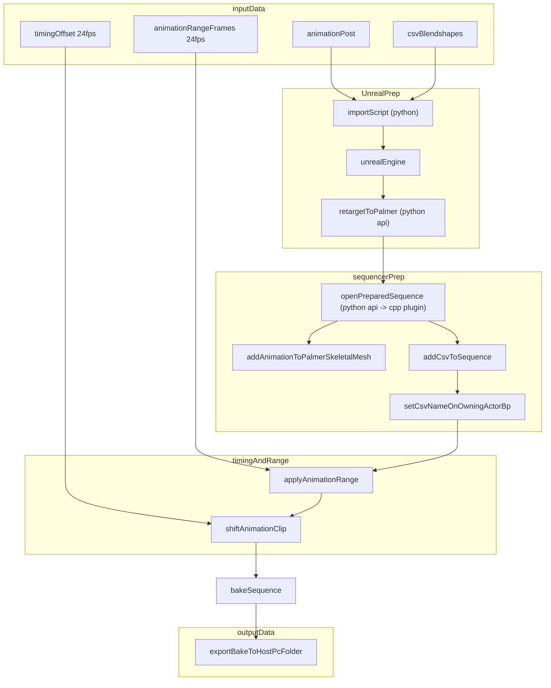

### inputData
- [x] Make sure we have csv Blendshapes (blendshapes)
- [x] Make sure we have the post animation (skeletal)
- [ ] Get the difference and foot detected output to every folder (timingOffset)
- [ ] Get the animation range for every rpm animation to every folder (animRange)

### Unreal prep
- [ ] Import script
	- [ ] Post animations into unreal engine
	- [ ] CSV blendshapes into unreal engine 
- [ ] Get retarget on Vicon pc from unreal pc
- [ ] Retarget post animation onto palmer

### sequencerPrep
- [ ] python script that uses plugin
	- [ ] open prepped sequencer
	- [ ] add csv to sequencer
	- [ ] add retargeted animation to sequencer
	- [ ] 
### outputData
- [ ] Make export script to get final animation out of unreal engine

