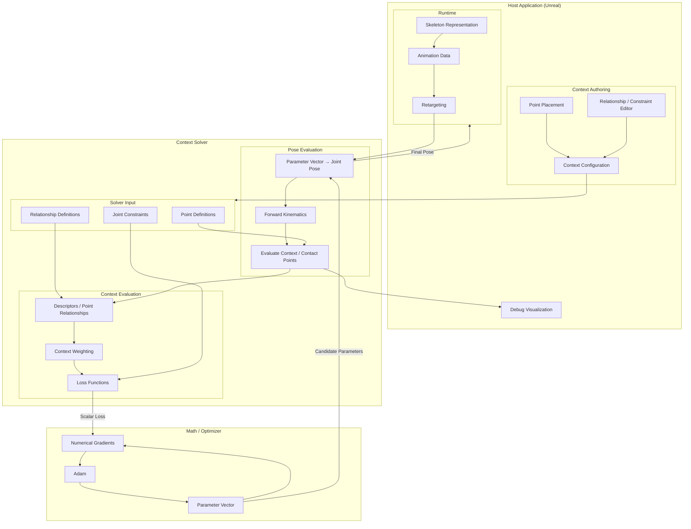

When the source context point is far from other point, there is no reason to make the target reproduce that exact relationship. As the source point approaches the other point, the relationship gradually activates.
This is called adaptive weighting, and is also a reason why adding context points in space and not only on the mesh is important.

