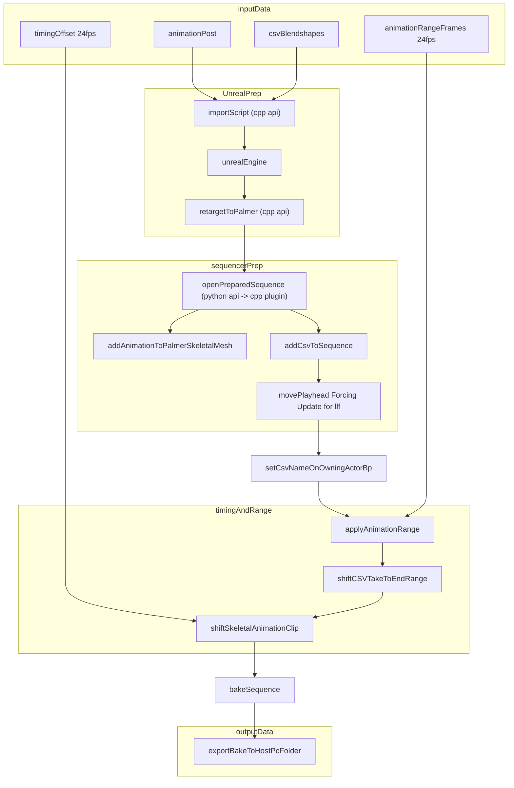

### inputData
- [x] Make sure we have csv Blendshapes (blendshapes)
- [x] Make sure we have the post animation (skeletal)
- [x] Get the difference and foot detected output to every folder (timingOffset)
- [x] Get the animation range for every rpm animation to every folder (animRange)

### Job queue
- [x] EUW containing:
	- [x] Joblist
		- [x] joblist done
		- [x] joblist to do
	- [x] Process next 100: All plugins to execute the pipeline
	- [x] Reset pipeline
		- [x] Sequencer cleanup
		- [x] Remove files (maybe will help with recordings, perhaps test first without doing this so we can test if it helps with the cache)
### Unreal prep
- [x] Import script
	- [x] Post animations into unreal engine
	- [x] CSV blendshapes into unreal engine (test if works with fix of name NumProperties To BlendshapeCount)
	- [x] get anim range
	- [x] get timing offset
- [x] Get retarget on Vicon pc from unreal pc, by hand ofcourse
- [x] By script Retarget post animation onto palmer
- [x] Why is it 120fps??? Because it was exported at 120fps from shogun post, no issue here.

### sequencerPrep
- [x] Script that uses all plugins
	- [x] open prepped sequencer (check skeletal add. cant we reuse a bp actor from prepared sequence?)
	- [x] add csv to sequencer
	- [x] add retargeted animation to sequencer
	- [x] Move anim
	- [x] Move csv
- [x] Update llf
- [x] Set csv name on palmer actor
### timingAndRange
- [x] Apply animation range
- [x] shift the skeletal animation based on timing offset
- [x] Shift the csv take to end at the range end
### outputData
- [x] Make export script to get final animation out of unreal engine (use the py that we are already using for its settings)
- [x] Set metadata for CC
- [x] Set jobs bool

- [ ] Do I care about the tposing at the beginning of some anims? We can maybe cut after processing? (example E:\Recordings\2025-11-18\M20240925_1925_251118_1)

