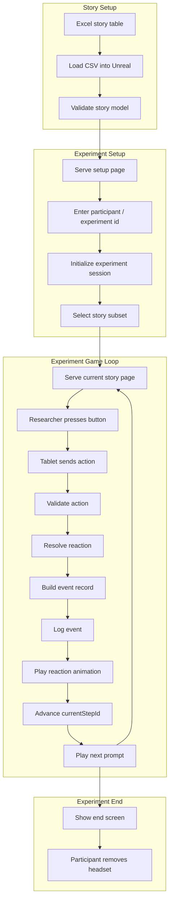

- [x] Github
- [x] RemoveBackWall? Kitchen?
### Overall ToDo
- [x] Start screen (fill in participant number on tablet + extra info, participant waits on this screen)
- [ ] Add reset/restart/end-experiment controls for every page
- [ ] Add basic error/status pages for every page
- [ ] End screen (participant is thanked and asked to de-equip headset)
---
## Game Loop ToDo
#### CSV Parser
- [x] Define CSV row schema
	- Question send to James
- [ ] Read input CSV story once into Unreal
- [ ] Convert/load CSV into an Unreal table or internal story model
- [ ] Validate all story subsets
--- 
#### Tablet setup
- [x] Add dynamic HTTP routes
- [x] Add ability to return generated HTML from C++
- [ ] Return generated html from story and bind to points
- [x] Serve initial setup page on tablet
- [x] Fill in participant/experiment number on tablet
- [ ] Use participant/experiment number to select rows from the loaded CSV
---
#### Unreal Setup
- [ ] Initialize experiment session in Unreal
- [ ] Serve current story page
---
#### During Experiment
- [ ] Handle tablet button/action submissions
- [ ] Validate submitted action against current step
- [ ] Resolve reaction for submitted action
- [ ] Build event record
- [ ] Log event once to a specific participant_id / story_id output CSV on the Unreal machine
- [ ] Play reaction line / animation
- [ ] Advance currentStepId to nextStepId
- [ ] Play next step prompt
- [ ] Serve refreshed story page
---
#### Synchronisation
How to sync all recordings?

# Experiment story workflow

---

### Experiment story / Trial Plan CSV
The story exists out of an input part with planned headers:
`participant_id`: participant/run identifier
`condition`: condition for this block/session, e.g. AV_noise
`step_id`: trial order within this participant/condition, e.g. 1, 2, 3
`prompt_animation`: question/prompt animation id, e.g. question_19
`gesture_mode`: gesture_present or gesture_absent
#### Experiment story / Trial Log CSV
And an output part that gets filled in during the experiment with planned headers:
`session_id`: A unique identifier, created to link the output CSVs together (based on the current session)
`participant_id`: participant/run identifier
`condition`: condition for this block/session, e.g. AV_noise
`step_id`: trial order within this participant/condition, e.g. 1, 2, 3
`prompt_animation`: question/prompt animation id, e.g. question_19
`gesture_mode`: gesture_present or gesture_absent
`action_key`: CORRECT or INCORRECT
`reaction_animation`: response animation id, e.g. resp_a
`timestamp_in`: time since entering the step_id and leaving it
`timestamp_out`: time since exiting the step_id
`reaction_recorded_at`: time that the experimenter clicked the reaction completed button
### Experiment Avatar prompt lists CSVs
We will have multiple prompt lists as input (useful if we want to randomize by hand), they will contain the headers:
`prompt_animation`: prompt/question animation id
`gesture_mode`: gesture_present or gesture_absent
`response_animation`: response pool/default response animation id
### Data logging output
Lastly, we should log a few more output files, related to how the participant acts during the experiment. Each line should contain the following information at least:
`session_id`: A unique identifier, created to link the output CSVs together (based on the current session)
`participant_id`: participant/run identifier
`timestamp_in`: time that this log is recorded
And the following are each files:
`gaze_record`: participant gaze record, e.g. face, chest, hands, arms, environment left, environment right, environment behind.
`hand_position`, `is_right_hand`: position in either world space or maybe actor space (if that is a thing)

---
### <u>Tablet game loop</u>
We can go the remote control route:
	Run with: `-RCWebControlEnable -RCWebInterfaceEnable`
	default: `ws://127.0.0.1:30020` and to reach pc ofc `ws://<pc_ip>:30020`
Or just use build in websocket support (might be easier?)
Made a plugin that uses the build in websocket support.
Example hello world html made.
- [ ] Implement game loop using tablet
	- Maybe serve new pages based on clicking?
	![[ExperimentFlowInteriorDialogue.png|400]]

<u>Logging</u>
- Logging hand position (30times a second minimal)
- Gaze hitboxes? Head, chest, environment?

<u>Dialogue Approach</u>
- Avatar gives a question
- Player responds, wizard of oz the progression through tablet

- [ ] Tablet websocket website progression, Unreal communication
- Log speech onset offset (through tablet?) (also through audio ingame)

<u>What will change in scene</u>
- Visual distraction level
- Noise level
- What the avatar is doing

Implementation order:
- [x] Implement VR in Unreal Engine
- [ ] Implement environment + selectable conditions
	- [x] Avatars
	- [x] Start Sounds
	- [x] Test locational audio
	- [x] Items to grab
- [ ] Implement game flow / experiment setup tools
- [ ] Implement data logging
	- [ ] Working with csv
	- [ ] Stopwatch
- [ ] Implement avatars + animation pipeline
- [ ] Pilot test interaction flow and VR comfort

<u>20/05</u>
- [x] Clean up project
- [x] VR
	- [x] OpenXR template
	- [x] Grabables
- [x] Avatar state and animation machines
	- [x] Statemachine
		- [x] Animation placeholders
			- [x] Download
			- [x] Implement
- [x] Adding my favorite plugins
	- [x] ToucanCCPicker
	- [x] CC support
	- [x] Sequencer abstraction
	- [x] ARKitCurveMapper
	- [x] UnrealMidi
- [ ] CC avatar
	- [x] James
	- [x] Jari
	- [x] Palmer
- [x] Improve scene
	- [x] More performance
	- [x] Smaller scene
	- [x] Baked lighting
- [x] Debug for VR development

<u>22/05</u>
- [x] CrowdLevel

<u>26/05</u>
- [x] Patch locational audio from config

### Internet Sources
[Lip syncing in realtime from audio - Development / Programming & Scripting - Epic Developer Community Forums](https://forums.unrealengine.com/t/lip-syncing-in-realtime-from-audio/1857173/15)
