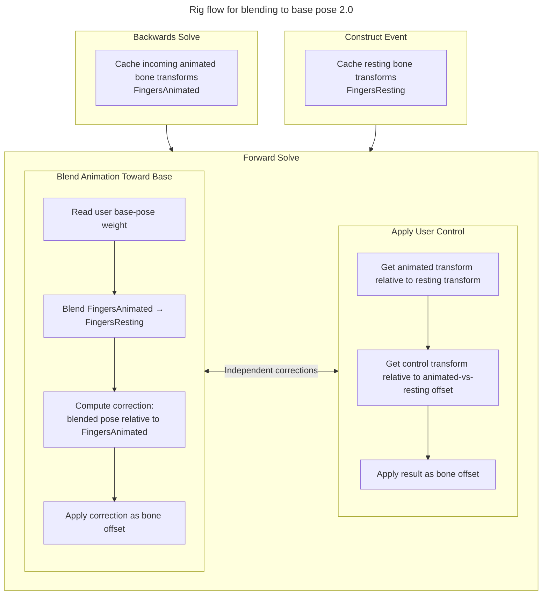

#PosePasting #PoseCaching

## Notes
Another route might be: Bake forward -> remove keyframes -> paste anim
Issue with this route might be that we will need to save poses on the fk-rig

## Return to base Pose
- [x] NamedTransformCache Plugin to save poses
- [x] Add Plugin to rig
	- [x] Cache the reference pose
		- [x] Test
	- [x] Add a weight to blend back to the base pose
		- Make sure in the forward as the first step so we can apply other stuff later
			I did that, but that wont work because the controls set stuff, so I put it last
		- [x] How do we solve the above issue, and is it an issue? We should test on an actual animation
		- [x] Make it keyable as a control
		- [x] Test blend back
- [ ] Rig changes to the Picker
	- [ ] Add weight to the picker
- [ ] Make the splay control offset instead of set. 
## Paste Pose
